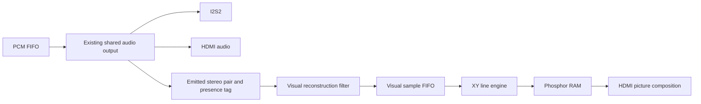

# First visualizer: O-Scope

Scope implementation and acceptance plan, 2026-10-06. This document specifies
the first implementation. The cycle ended with passing simulations and
failed FPGA timing; see [oscope-handoff.md](oscope-handoff.md) for the terminal
result and next steps. Hardware is unqualified. The qualified playback
baseline is Tang-Phosphor `1941765` (core-log entry 78). External audio input
and Siglent testing remain deferred. The Tang canvas is 512x512 with eight-bit
display brightness; the 256x256 MiSTer design remains the behavioral reference.

## Reference behavior

Use MiSTer-Phosphor commit `183b514ceb98afd373d2bd8d8b9425e1df74bd15`:

- [Stereo XY renderer](https://github.com/aquasock/MiSTer-Phosphor/blob/183b514ceb98afd373d2bd8d8b9425e1df74bd15/rtl/media_xy_visualizer.sv)
- [Audio observation and queue](https://github.com/aquasock/MiSTer-Phosphor/blob/183b514ceb98afd373d2bd8d8b9425e1df74bd15/rtl/media_audio_visualizers.sv)
- [2x reconstruction filter](https://github.com/aquasock/MiSTer-Phosphor/blob/183b514ceb98afd373d2bd8d8b9425e1df74bd15/rtl/media_xy_interpolator.sv)

MiSTer's O-Scope is a stereo X/Y vectorscope: left controls horizontal
position, right controls vertical position. It connects successive points
and stores eight brightness levels in a 256x256 phosphor plane. A green
trace fades against black. Its time-domain display is named Waveforms and
is a separate visualizer.

Preserve that distinction, channel mapping, square aspect and persistence.
Write Tang-native RTL with Gowin-compatible memories. MiSTer's Intel RAM
attributes and asynchronous FIFO primitive cannot be carried over directly;
the existing THIRD_PARTY.md reference records the provenance.

## First visible result

Show a centered 720x720 square in the existing 1280x720 HDMI picture:
horizontal coordinates 280 through 999, vertical coordinates 0 through 719.
Map that square to a 512x512 phosphor plane with phase accumulators,
avoiding division in the pixel path. The unequal 1/2-pixel cell widths are
nearest-neighbor scaling; both axes use the same mapping. The display adds a separable narrow glow filter after the geometry and RAM
schedule; the glow can be disabled independently.

Use signed 16-bit playback PCM at its native 44.1 or 48 kHz. Follow the
reference signed mapping at higher resolution: X is left bits [15:7] XOR
0x100; Y is the complement of right bits [15:7] XOR 0x100. This places negative X to the left and
positive Y upward. No automatic gain, normalization or channel mixing is
applied. A quiet recording produces a smaller trace. No grid or measurement
labels are added to this first music visualizer.

Connect points with an integer line engine. Store a validity bit and an
8-bit timestamp per pixel, then derive eight-bit brightness from age at
scanout. The clock advances at 240 Hz; a linear age ramp followed by a
quadratic brightness curve produces the fade. Short, medium, long and very
short settings reach black after approximately 133, 267, 533 and 67 ms,
respectively. These are 32, 64, 128 and 16 age steps; eight-bit RGB channels do
not imply 256 distinct temporal steps in each trail setting. Blank the display
during initialization so uninitialized RAM never appears.

## Audio observation and buffering



Observe the pixel-domain emitted pair from `i2s_playback`, with its existing
one-cycle `clk_audio` pulse as a clock enable. Do not observe decoder writes
or the FIFO fetch request: those precede presentation and can include data
later discarded by a flush. The emitted pair is the pair supplied to both
HDMI and the DAC for that audio frame.

Add an observation-only sample-presence tag to the bridge, carried with the
held pair through its existing handshake and returned alongside the emitted
pair. It distinguishes real PCM, including a real zero sample, from synthetic
silence during idle, pause, startup and rate settling. This avoids losing the
last prefetched PCM frame by gating with a player status that changes early.
The tag must not change the sample cadence, PCM pop decision or audio words.

Everything after this existing crossing runs on `clk_pixel` at 74.25 MHz.
Use a synchronous FIFO, initially 256 entries of coherent stereo pairs,
between visual processing and the line engine. Renderer readiness terminates
at this FIFO; no readiness signal returns to the player or audio bridge.
Overflow discards visual work only, increments a counter, and breaks line
continuity before the next retained point so a missing run cannot create a
long catch-up line. Queue ordering is preserved. Exact overflow handling is
tested, not left to RAM read/write behavior.

MiSTer uses a 15-tap, 2x half-band reconstruction filter in the visual branch.
Include equivalent filtered reconstruction in the first complete visualizer,
after the native-point renderer is verified. It changes the displayed curve
only. The emitted audio remains untouched. Compute using captured pairs,
pipeline the arithmetic, preserve stereo phase, and test rounding and
saturation independently. The internal build-up can bypass this filter while
testing the line engine; the final visualizer should include it.

## Video integration and state

Add the scope as a picture source inside `ui_hdmi_backend`, before
`ui_desk_layer`. The desktop retains priority. Keep the current menu picture
available when the scope is disabled. The existing 96x64 store remains the
menu and panel store; it is not enlarged or used to carry the XY picture.

Use registered RAM reads and compensate coordinate/read latency before the
transmitter consumes RGB. This backend uses the transmitter's current raster
coordinates; inserting an arbitrary delayed RGB overlay would shift pixels
relative to HDMI timing. Compare complete emitted rasters against a software
model, including square edges and blanking. VGA, when used later, must observe
the same final raster. The source/panel checksums continue to describe the menu. Register 0xcc
describes the selected HDMI picture, including the scope when enabled, before
desktop composition.

ABI 1.10 exposes control at 0xac, cumulative discarded visual points at 0xb0,
status and queue occupancy at 0xb4, and completed retirement sweeps at 0xb8.
Control bit 0 enables the scope, bits 2:1 select persistence and bit 3 enables
glow. Settings latch at a video frame boundary; changing them clears visual
history. See [debug-registers.md](debug-registers.md) for status fields.

`tools/oscope.tdsh` loads `/cores/console138k/phosphortang-oscope.bin`, declares
the installed I2S2 and enables medium trails with glow. Use the existing
TinyTang commands; keyboard navigation and new firmware remain outside this
cycle:

```text
/scripts/oscope.tdsh
phosphor play /music/scope-circle-48000.wav
phosphor poke 0xac 0x9   # short trails, glow
phosphor poke 0xac 0xb   # medium trails, glow
phosphor poke 0xac 0xd   # long trails, glow
phosphor poke 0xac 0x3   # medium trails, no glow
phosphor poke 0xac 0     # menu picture
```

Pause stops adding PCM points and lets the visible trace decay. Resume starts
a fresh line without connecting across the paused interval. Cancel, a new
independent stream, a rate change or re-enabling the scope flushes visual
history and starts a new drawing epoch. Idle does not continuously repaint a
synthetic center dot. Genuine digital silence during active playback may draw
the center. Mode-off and initialization intervals are excluded from overflow
statistics. Mode changes and resets never gate or reset audio playback.

## Resources and scheduling

The logical phosphor plane is 512x512x9 bits: 288 KiB including validity.
Eight interleaved banks each use sixteen 2Kx9 DPX9B primitives, totaling 128
physical BSRAM blocks. The ninth bit uses the primitive's parity capacity.
A 256-entry 33-bit visual FIFO carries stereo PCM and a discontinuity marker;
three 512-byte scan-line caches support the display filter.

The qualified playback build uses about 11 percent of logic, 127/340 BSRAM
blocks, 1/298 DSP resources, and 8/8 primary clock routes. The scope adds no
PLL, primary clock or DDR3 dependency. Final resources and timing must be
measured on the integrated build.

The installed Gowin UG300-1.3.6E memory guide, tables 2-1/2-3 and section 3.1,
prohibits a read on one port concurrent with a write on the other to the same
physical address region. The wrapper uses explicit normal-write DPX9B
primitives: GW5AST-138K does not support read-before-write mode. Hardware is
the default source branch; portable simulation requires
`SCOPE_RAM_BEHAVIORAL`. Gowin does not automatically define `SYNTHESIS`.
`tools/check_scope_ram.sh` compares the portable model with Gowin's installed
primitive model, including all 128 blocks and both ports' two-cycle latency.

Scanout prefetches three source rows during the left black bar and publishes
its cache before visible pixels. Line writes stall on a simultaneous prefetch
read in the same physical collision region, comparing the logical address
with its low bit removed. Neither port performs an own-port read and write
in the same cycle.

The timestamp approach avoids rewriting every brightness value each frame.
A four-cycle background transaction, starting every sixteen clocks, reads and
retires eight pixels together. It clears valid timestamps at age 128 before
the 256-tick clock wraps. The nominal full-plane retirement interval is about
7.06 ms, far below the 533 ms margin between expiration and wrap. New line
writes and retirement writes use the same port, so they cannot race. Completed
sweeps are counted at 0xb8.

At 48 kHz, 2x reconstruction produces 96000 points per second. A longest
512-pixel segment per point needs about 49.2 million line steps per second.
The retirement schedule leaves up to 55.7 million update cycles per second
before line setup and prefetch hazards. The queue absorbs bursts; pathological
load may discard visual points, mark the discontinuity and increment 0xb0.
These are nominal budgets, not a guarantee for every possible PCM sequence.
Audio consumption remains independent. The renderer bench checks both native
cadence and deliberately overloaded input.

## Effects roadmap

The first complete scope should establish the larger canvas, smoother decay,
filtered stereo path and controls, followed by a restrained beam/glow pass.
The effect stages are independently selectable so a faithful stereo mapping
remains available.

| Stage | Visual result | Main resource consideration |
|---|---|---|
| First scope | 512x512, eight-bit display brightness, green beam, adjustable trails | Banked RAM update schedule and exact sample observation |
| Beam finish | Softer edges, narrow bright core, glow halo, brightness curve | Pipelined scanout filters and small line caches |
| Color and motion | Palette themes, optional rotation and zoom, stereo-dependent color | DSP arithmetic; additional state if color must persist per pixel |
| Audio features | Spectrum, spectrogram, stereo correlation, onset/envelope-driven effects | FFT/filter pipelines and history RAM |
| Larger scenes | Wireframe shapes, bounded particle systems, procedural backgrounds | Primitive count, overdraw and memory traffic |
| Stored full scenes | Full-frame persistence, more color precision, multi-pass bloom or feedback | A separate DDR3 renderer/arbitration design |

For scale, a 512x512 four-bit plane is 128 KiB; an eight-bit plane is 256 KiB.
A native 720x720 eight-bit plane is about 506 KiB and exceeds the current
unused on-chip RAM at 16 Kbits per block. Full 1280x720 RGB storage is still
larger. Procedural full-screen shaders do not necessarily require such image
storage; full-screen history and image feedback do. DDR3 is already used by
the audio CPU, so visual access would require an arbiter, bounded bursts and
scanout buffering, with playback progress protected. Its bandwidth is not
currently qualified for visual rendering.

Glow can begin with a small neighborhood filter and then expand to a
lower-resolution bloom plane; it does not require a full-resolution RGB
framebuffer. Subpixel line coverage, additive beam energy and larger kernels
increase write/processing work and should follow measured scheduling margin.
Point count alone is not a sufficient particle budget: particle area, blending
and overlap determine fill cost. Artistic transformations and dynamic gain
are explicit effects, not changes to the faithful channel mapping.

## Implementation and acceptance

1. Implement and simulate native point mapping, queue ordering, line drawing,
   deterministic memory arbitration and fading. Compare pixels with an
   independent host model, including overflow and discontinuities.
2. Add and verify the 2x reconstruction filter, then integrate the observation
   tag, scope picture source and minimal controls. Check the complete video
   raster and verify that enabling or overloading the scope leaves audio
   samples, timing and underrun behavior unchanged.
3. Run the full existing regression suite and four-placement build. Deploy
   only an image meeting setup and hold timing, to a separate SD path, with
   the matching launch script. Retain the qualified playback image.
4. Use deterministic PCM fixtures: identical channels give a diagonal;
   opposite channels give the other diagonal; equal quadrature sines give a
   circle; left-only/right-only give horizontal/vertical lines. Full-scale
   endpoints, zeros, abrupt changes and high-frequency samples check signs,
   boundaries and reconstruction. Generate fixtures with `python3 tools/make_scope_fixtures.py`; use `--rate
   44100` for the second native rate.
5. Run `python3 tools/oscope_check.py` to check fixture counts, native clocks,
   retirement progress and visual queue health. Run
   `python3 tools/i2s2_format_sweep.py` for the twelve-format corpus. Listen
   while playing fixtures and music. Confirm smooth
   connected green traces, decay, correct square geometry, selectable persistence, pause/resume,
   switching both ways between 44.1/48 kHz, and zero audio underruns. Check
   visual drops and fade completion under worst-case input. Record the user's
   hardware acceptance before the normal log, commit and push step.

The accepted result is the first stereo XY music visualizer on HDMI with
shared I2S2/HDMI playback. Waveforms, FFT, line input, arbitrary gain controls,
OLED presentation and external measurement work remain separate follow-ups.
